TSA GARCH
================
David Alexander Moe
2023-06-15

Read the **REPORT** for a better understanfing of the analysis.

The analysis concerns the listing of Activision Blizzard, Inc. (ATVI), a
US company that produces and distributes video games. The data, on a
daily basis, can be found on Yahoo Finance
(<https://it.finance.yahoo.com/quote/ATVI?p=ATVI&.tsrc=fin-srch>) range
from 5 January 2015 to 31 December 2021 (1762 observations). The
available variables are “open”, the opening prices, “close”, the closing
prices, “high”, the highest price, “low”, the lowest price, “volume”,
number of shares traded, and “adjusted”, i.e. the “close” prices
adjusted for dividends. The objective of the analysis is to forecast
volatility in the next 10 days from 1 January 2022 to 12 January 2022
(excluding Saturdays and Sundays)

## Importing necessary dependencies

Importing libraries and functions that will be useful throughout the
analysis.

``` r
rm(list = ls())

################################################################################
## Loading
################################################################################

#### Libraries
library(tseries)  
```

    ## Warning: il pacchetto 'tseries' è stato creato con R versione 4.3.1

    ## Registered S3 method overwritten by 'quantmod':
    ##   method            from
    ##   as.zoo.data.frame zoo

``` r
library(sandwich)
```

    ## Warning: il pacchetto 'sandwich' è stato creato con R versione 4.3.1

``` r
library(lmtest)
```

    ## Warning: il pacchetto 'lmtest' è stato creato con R versione 4.3.1

    ## Caricamento del pacchetto richiesto: zoo

    ## Warning: il pacchetto 'zoo' è stato creato con R versione 4.3.1

    ## 
    ## Caricamento pacchetto: 'zoo'

    ## I seguenti oggetti sono mascherati da 'package:base':
    ## 
    ##     as.Date, as.Date.numeric

``` r
library(urca)     ## For unit root
```

    ## Warning: il pacchetto 'urca' è stato creato con R versione 4.3.1

``` r
library(rugarch)  ## For GARCH models
```

    ## Warning: il pacchetto 'rugarch' è stato creato con R versione 4.3.1

    ## Caricamento del pacchetto richiesto: parallel

    ## 
    ## Caricamento pacchetto: 'rugarch'

    ## Il seguente oggetto è mascherato da 'package:stats':
    ## 
    ##     sigma

``` r
library(FinTS)    ## For ArchTest (download from RForge)
```

    ## Warning: il pacchetto 'FinTS' è stato creato con R versione 4.3.1

``` r
library(car)
```

    ## Warning: il pacchetto 'car' è stato creato con R versione 4.3.1

    ## Caricamento del pacchetto richiesto: carData

    ## Warning: il pacchetto 'carData' è stato creato con R versione 4.3.1

``` r
library(forecast) 
```

    ## Warning: il pacchetto 'forecast' è stato creato con R versione 4.3.1

    ## 
    ## Caricamento pacchetto: 'forecast'

    ## Il seguente oggetto è mascherato da 'package:FinTS':
    ## 
    ##     Acf

``` r
library(xts)      ## For time stamps
```

    ## Warning: il pacchetto 'xts' è stato creato con R versione 4.3.1

``` r
library(quantmod) ## For downloading data
```

    ## Warning: il pacchetto 'quantmod' è stato creato con R versione 4.3.1

    ## Caricamento del pacchetto richiesto: TTR

    ## Warning: il pacchetto 'TTR' è stato creato con R versione 4.3.1

Look at the “Functions” folder to see all the specific details about the
functions.

``` r
source("G:\\Il mio Drive\\TRIENNALE\\TS Analysis\\Financial-TSA-GARCH-models\\Functions\\TSA-Predict-Functions.R")
source("G:\\Il mio Drive\\TRIENNALE\\TS Analysis\\Financial-TSA-GARCH-models\\Functions\\TSA-Finance-Functions.R")
```

## Read data and declare some external variables

``` r
################################################################################
## Input
################################################################################

#### Data
file.data <- "G:\\Il mio Drive\\TRIENNALE\\TS Analysis\\ATVI.csv"

################################################################################
## Read data
################################################################################

#### Read
data <- read.table(file = file.data, header = TRUE, sep = ",", 
                     check.names = FALSE, comment.char = "", na.strings = ".")

#### Add variables
colnames(data)[6] <- "Adjusted"
data <- data.frame(data, 
                   cc.ret = c(NA, diff(log(data$Adjusted))), 
                   gkVol = .garmanklass(data = data, sd = TRUE),
                   check.names = TRUE)
```

- cc.ret are the close-to-close returns: log(close price
  today/yesterday)
- gkVol is the garman klass volatility, really useful since it accounts
  for open, high, low, and closing prices as follows:
  $\sigma_{GK} = \sqrt{\frac{1}{N-1} \sum_{i=1}^{N} \left(\ln\left(\frac{H_i}{L_i}\right)\right)^2 - \frac{2}{N(N-1)} \sum_{i=1}^{N-1} \ln\left(\frac{C_i}{O_{i+1}}\right) \ln\left(\frac{O_i}{C_{i+1}}\right)}$

``` r
#### Extract period
#ind   <- as.Date(x = "2011-01-03") <= as.Date(x = data$Date) #fino a nyblom ho ottenuto i risultati con queste
ind   <- as.Date(x = "2015-01-03") <= as.Date(x = data$Date)
data  <- data[ind, , drop = FALSE]

#### Extract variables
time  <- as.Date(x = data$Date)
yc    <- data$Close
yclog <- log(yc)
y     <- data$Adjusted
ylog  <- log(y)
```

## Preliminary analysis

``` r
#### Auxiliary quantities
nobs <- NROW(y)

#### Plots
par(mfrow = c(2,2))
plot(x = time, y = yc,    main = "Close",        xlab = "Tempo", ylab = "Prezzo", type = "l")
plot(x = time, y = yclog, main = "Ln(close)",    xlab = "Tempo", ylab = "Prezzo", type = "l")
plot(x = time, y = y,     main = "AdjClose",     xlab = "Tempo", ylab = "Prezzo", type = "l")
plot(x = time, y = ylog,  main = "Ln(AdjClose)", xlab = "Tempo", ylab = "Prezzo", type = "l")
```

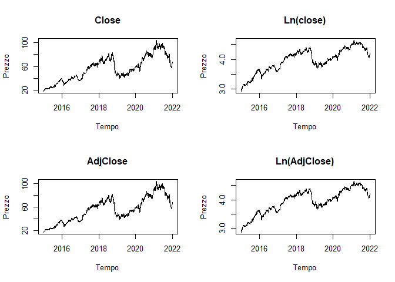<!-- -->

  
The patterns do not appear to exhibit significant differences in terms
of their behavior, as per the Random Walk (RW) style analysis. However,
there are variations in the values.

To mitigate the impact of dividends, we will analyze the adjusted
values, which account for the dividend effect.

We will employ a logarithmic scale for the following reasons:

- allows for a clearer visualization of changes and fluctuations.

- because it aligns returns with prices on a logarithmic scale, as they
  represent the first differences of logarithmic prices
  (deltalogprezzi).

From this point onward, our analysis will focus on log(Adjusted) values.

The Figures are showing atrend of “adjusted” prices, the one on the
right is in a logarithmic scale often preferred because it better
captures the variations. A growing trend emerges interrupted by negative
phases in 2019 and 2021.

The data appear to be non-stationary, a fact confirmed by the linear
decay of the ACF and by $\phi_{1}$ close to 1 in the PACF, as visible
here.

``` r
#### Serial correlation
par(mfrow = c(2,1))
Acf(x = ylog, lag.max = 150, type = "correlation", main = "Price")
Acf(x = ylog, lag.max = 150, type = "partial", main = "Price")
```

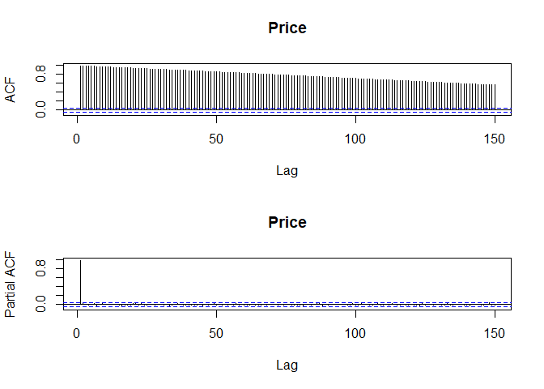<!-- -->

``` r
######### ADF tests using the Di Fonzo-Lisi procedure
cat("\n-----------------------------------------------------------------
  Unit root analysis following the Di Fonzo-Lisi procedure\n")
```

    ## 
    ## -----------------------------------------------------------------
    ##   Unit root analysis following the Di Fonzo-Lisi procedure

``` r
#### (DGP:   RW + drift (+ other possible stationary terms); 
##    Model: AR(1) + Trend (+ other possible stationary terms))
adf.1 <- ur.df(y = ylog, type = "trend", lags = 20, selectlags = "AIC")
cat("\n-----\nTest1: ADF with trend\n")
```

    ## 
    ## -----
    ## Test1: ADF with trend

``` r
print( summary(adf.1) )
```

    ## 
    ## ############################################### 
    ## # Augmented Dickey-Fuller Test Unit Root Test # 
    ## ############################################### 
    ## 
    ## Test regression trend 
    ## 
    ## 
    ## Call:
    ## lm(formula = z.diff ~ z.lag.1 + 1 + tt + z.diff.lag)
    ## 
    ## Residuals:
    ##       Min        1Q    Median        3Q       Max 
    ## -0.153133 -0.010416  0.000861  0.011234  0.172263 
    ## 
    ## Coefficients:
    ##                Estimate Std. Error t value Pr(>|t|)    
    ## (Intercept)   1.911e-02  7.997e-03   2.389 0.016984 *  
    ## z.lag.1      -5.185e-03  2.366e-03  -2.191 0.028555 *  
    ## tt            2.282e-06  1.891e-06   1.207 0.227701    
    ## z.diff.lag1  -7.652e-02  2.405e-02  -3.182 0.001488 ** 
    ## z.diff.lag2  -4.236e-02  2.410e-02  -1.757 0.079037 .  
    ## z.diff.lag3   3.886e-03  2.412e-02   0.161 0.872034    
    ## z.diff.lag4  -8.164e-03  2.408e-02  -0.339 0.734655    
    ## z.diff.lag5  -4.300e-02  2.408e-02  -1.786 0.074347 .  
    ## z.diff.lag6   4.498e-02  2.410e-02   1.867 0.062139 .  
    ## z.diff.lag7   1.352e-02  2.411e-02   0.561 0.575116    
    ## z.diff.lag8  -4.804e-02  2.412e-02  -1.992 0.046569 *  
    ## z.diff.lag9   8.887e-02  2.406e-02   3.694 0.000228 ***
    ## z.diff.lag10 -2.546e-02  2.412e-02  -1.056 0.291336    
    ## z.diff.lag11 -3.143e-02  2.413e-02  -1.302 0.193015    
    ## z.diff.lag12  3.488e-02  2.402e-02   1.452 0.146592    
    ## z.diff.lag13 -1.012e-02  2.400e-02  -0.422 0.673418    
    ## z.diff.lag14  6.574e-02  2.400e-02   2.740 0.006212 ** 
    ## z.diff.lag15  3.167e-02  2.404e-02   1.317 0.187892    
    ## z.diff.lag16  3.330e-02  2.403e-02   1.386 0.165922    
    ## z.diff.lag17  5.985e-02  2.395e-02   2.499 0.012544 *  
    ## ---
    ## Signif. codes:  0 '***' 0.001 '**' 0.01 '*' 0.05 '.' 0.1 ' ' 1
    ## 
    ## Residual standard error: 0.02079 on 1721 degrees of freedom
    ## Multiple R-squared:  0.03852,    Adjusted R-squared:  0.0279 
    ## F-statistic: 3.629 on 19 and 1721 DF,  p-value: 2.023e-07
    ## 
    ## 
    ## Value of test-statistic is: -2.1914 2.6063 3.1395 
    ## 
    ## Critical values for test statistics: 
    ##       1pct  5pct 10pct
    ## tau3 -3.96 -3.41 -3.12
    ## phi2  6.09  4.68  4.03
    ## phi3  8.27  6.25  5.34

``` r
#### Comment: Accept for tau3, Accept for Phi3 -> look at Phi2.
##   Accept for Phi2. According to the procedure, we have now to assume
##   (DGP:   RW; 
##    Model: AR(1) + constant (+ other possible stationary terms))

#### (DGP:   RW; 
##    Model: AR(1) + constant (+ other possible stationary terms))
adf.2 <- ur.df(y = ylog, type = "drift", lags = 20, selectlags = "AIC")
cat("\n-----\nTest1: ADF with drift\n")
```

    ## 
    ## -----
    ## Test1: ADF with drift

``` r
print( summary(adf.2) )
```

    ## 
    ## ############################################### 
    ## # Augmented Dickey-Fuller Test Unit Root Test # 
    ## ############################################### 
    ## 
    ## Test regression drift 
    ## 
    ## 
    ## Call:
    ## lm(formula = z.diff ~ z.lag.1 + 1 + z.diff.lag)
    ## 
    ## Residuals:
    ##      Min       1Q   Median       3Q      Max 
    ## -0.15220 -0.01048  0.00079  0.01120  0.17221 
    ## 
    ## Coefficients:
    ##               Estimate Std. Error t value Pr(>|t|)    
    ## (Intercept)   0.011597   0.005022   2.309 0.021052 *  
    ## z.lag.1      -0.002769   0.001261  -2.196 0.028238 *  
    ## z.diff.lag1  -0.078159   0.024011  -3.255 0.001155 ** 
    ## z.diff.lag2  -0.043995   0.024070  -1.828 0.067750 .  
    ## z.diff.lag3   0.002211   0.024083   0.092 0.926873    
    ## z.diff.lag4  -0.010005   0.024039  -0.416 0.677315    
    ## z.diff.lag5  -0.044820   0.024039  -1.864 0.062424 .  
    ## z.diff.lag6   0.043078   0.024049   1.791 0.073433 .  
    ## z.diff.lag7   0.011618   0.024062   0.483 0.629274    
    ## z.diff.lag8  -0.049959   0.024070  -2.076 0.038084 *  
    ## z.diff.lag9   0.086808   0.024001   3.617 0.000307 ***
    ## z.diff.lag10 -0.027498   0.024062  -1.143 0.253276    
    ## z.diff.lag11 -0.033516   0.024075  -1.392 0.164050    
    ## z.diff.lag12  0.032762   0.023956   1.368 0.171616    
    ## z.diff.lag13 -0.012213   0.023943  -0.510 0.610049    
    ## z.diff.lag14  0.063688   0.023939   2.660 0.007876 ** 
    ## z.diff.lag15  0.029567   0.023983   1.233 0.217808    
    ## z.diff.lag16  0.031257   0.023971   1.304 0.192427    
    ## z.diff.lag17  0.057914   0.023897   2.423 0.015474 *  
    ## ---
    ## Signif. codes:  0 '***' 0.001 '**' 0.01 '*' 0.05 '.' 0.1 ' ' 1
    ## 
    ## Residual standard error: 0.02079 on 1722 degrees of freedom
    ## Multiple R-squared:  0.0377, Adjusted R-squared:  0.02765 
    ## F-statistic: 3.748 on 18 and 1722 DF,  p-value: 1.758e-07
    ## 
    ## 
    ## Value of test-statistic is: -2.1958 3.1805 
    ## 
    ## Critical values for test statistics: 
    ##       1pct  5pct 10pct
    ## tau2 -3.43 -2.86 -2.57
    ## phi1  6.43  4.59  3.78

``` r
#### Comment: Accept for tau2, Accept for Phi1 -> Unit root.
#### IMPORTANT: This conclusion is typical in time series of daily prices of 
#financial assets. Quindi ho UR, non è staz e l ur non dip dalla parte stag perche di stagionalita non ne ho 

#prezzi non stazionari -> altro motivo per cui uso log rendimenti
```

The ADF test confirms the presence of a Unit Root.

``` r
################################################################################
## Preliminary analyses of log-returns
################################################################################

#### Percentage log-returns
yret <- xts(x = 100 * data$cc.ret, order.by = time)
#ci associo il tempo con xts()
#puo capitare che sia scomodo in alcuni casi
# yret <- 100 * data$cc.ret

######## Preliminary analysis
cat("\n-----------------------------------------------------------------
  Preliminary analysis of log-returns\n")
```

    ## 
    ## -----------------------------------------------------------------
    ##   Preliminary analysis of log-returns

``` r
#### Time series
par(mfrow = c(1,1))
plot(x = time, y = yret, main = "Returns", 
     xlab = "", ylab = "", type = "l")
```

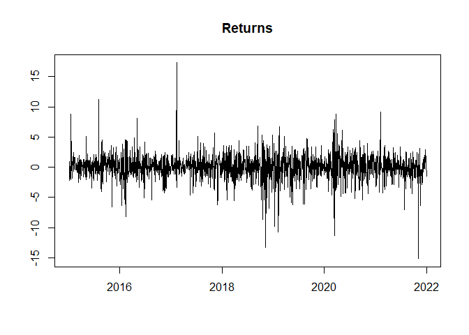<!-- -->

``` r
# ts dei rendimenti
# dal plot si vede che ci sono dei picchi -> quelle oss si concentreranno nelle code della distr
# non condizionata dei rendimenti, quelle in cui c ? poca variabilita invece al centro


####  Comments: 
##   1) Daily returns move around a mean close to zero similarly to a WN
##      con tanta ETEROSCHEDASTICITA e MEDIA VICINO A ZERO
##      mean(yret) -> media giornaliera
##      questo perche le differenze prime di un RW (log prezzi simili a RW) 
##      sono un WN; 
##   2) There are periods with different variability around the mean (sometimes 
##      high, sometimes low) -> volatility clustering
##   3) Non sembre aver risentito della crisi del covid (argomentare)
```

``` r
#### Serial correlation
par(mfrow = c(2,1))
Acf(x = yret, lag.max = 150, type = "correlation", main = "Returns")
Acf(x = yret, lag.max = 150, type = "partial", main = "Returns")
```

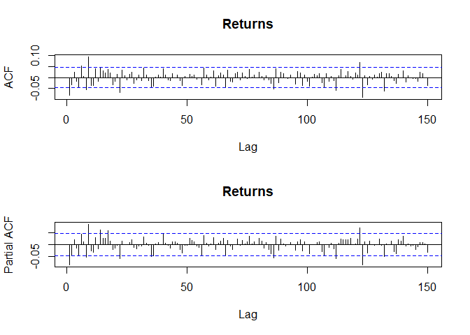<!-- -->

``` r
#atvi fa un po eccezione -> per il primo lag picco negativo ai primi lag 
#(che sono comunque molto bassi = -0.05 basso in termini assoluti)
#si ritrova la SOMIGLIANZA e non uguaglianza ad un WN, motivo anche delle somiglianza di acf e pacf
```

Figures show yield plots with the corresponding ACF and PACF.The
log-returns values seem to behave like a WN (in fact ACF and PACF are
similar) with mean 0 with the difference that the volatility varies over
time.

``` r
cat("\nLjung-Box statistics on log-returns\n")
```

    ## 
    ## Ljung-Box statistics on log-returns

``` r
npar <- 0
lag <- c(2, 5, 10, 15, 20, 30, 50) + npar
lb <- mapply(FUN = Box.test, lag = lag, 
             MoreArgs = list(x = yret, type = "Ljung-Box", fitdf = npar))[1:3,]
print(rbind(lag = lag, lb))
```

    ##           [,1]         [,2]        [,3]         [,4]         [,5]        
    ## lag       2            5           10           15           20          
    ## statistic 14.27905     19.36989    48.9135      60.77081     66.95311    
    ## parameter 2            5           10           15           20          
    ## p.value   0.0007931303 0.001639798 4.224641e-07 1.857948e-07 5.679909e-07
    ##           [,6]         [,7]        
    ## lag       30           50          
    ## statistic 80.88477     99.23233    
    ## parameter 30           50          
    ## p.value   1.472825e-06 4.241883e-05

``` r
#### Comment: All significant but it is quite uncommon (rifuito H0 per tutte)
```

``` r
#### A further check should be "do an ADF test on returns to check whether they 
##   have additional UR's", the result is easily predictable -> no ur
#levo la prima oss perch? NA

######### ADF tests using the Di Fonzo-Lisi procedure on Log(returns)
cat("\n-----------------------------------------------------------------
  Unit root analysis following the Di Fonzo-Lisi procedure\n")
```

    ## 
    ## -----------------------------------------------------------------
    ##   Unit root analysis following the Di Fonzo-Lisi procedure

``` r
#### (DGP:   RW + drift (+ other possible stationary terms); 
##    Model: AR(1) + Trend (+ other possible stationary terms))
adf.1 <- ur.df(y = yret, type = "trend", lags = 20, selectlags = "AIC") #yret[-1] quando uso tutte le oss
cat("\n-----\nTest1: ADF with trend\n")
```

    ## 
    ## -----
    ## Test1: ADF with trend

``` r
print( summary(adf.1) )
```

    ## 
    ## ############################################### 
    ## # Augmented Dickey-Fuller Test Unit Root Test # 
    ## ############################################### 
    ## 
    ## Test regression trend 
    ## 
    ## 
    ## Call:
    ## lm(formula = z.diff ~ z.lag.1 + 1 + tt + z.diff.lag)
    ## 
    ## Residuals:
    ##      Min       1Q   Median       3Q      Max 
    ## -15.2280  -1.0521   0.0747   1.1015  17.2625 
    ## 
    ## Coefficients:
    ##                Estimate Std. Error t value Pr(>|t|)    
    ## (Intercept)   0.1732201  0.1042248   1.662 0.096698 .  
    ## z.lag.1      -0.9520630  0.1091470  -8.723  < 2e-16 ***
    ## tt           -0.0001225  0.0001009  -1.214 0.224960    
    ## z.diff.lag1  -0.1269035  0.1064392  -1.192 0.233322    
    ## z.diff.lag2  -0.1715525  0.1035280  -1.657 0.097689 .  
    ## z.diff.lag3  -0.1699362  0.1003835  -1.693 0.090661 .  
    ## z.diff.lag4  -0.1805859  0.0966988  -1.868 0.062000 .  
    ## z.diff.lag5  -0.2260147  0.0929667  -2.431 0.015153 *  
    ## z.diff.lag6  -0.1835380  0.0888654  -2.065 0.039039 *  
    ## z.diff.lag7  -0.1725671  0.0847445  -2.036 0.041871 *  
    ## z.diff.lag8  -0.2231843  0.0805918  -2.769 0.005678 ** 
    ## z.diff.lag9  -0.1369676  0.0755430  -1.813 0.069989 .  
    ## z.diff.lag10 -0.1651935  0.0704973  -2.343 0.019229 *  
    ## z.diff.lag11 -0.1994028  0.0649635  -3.069 0.002178 ** 
    ## z.diff.lag12 -0.1671312  0.0585217  -2.856 0.004343 ** 
    ## z.diff.lag13 -0.1798992  0.0518519  -3.469 0.000534 ***
    ## z.diff.lag14 -0.1166970  0.0444001  -2.628 0.008657 ** 
    ## z.diff.lag15 -0.0877759  0.0352880  -2.487 0.012961 *  
    ## z.diff.lag16 -0.0571997  0.0239432  -2.389 0.017003 *  
    ## ---
    ## Signif. codes:  0 '***' 0.001 '**' 0.01 '*' 0.05 '.' 0.1 ' ' 1
    ## 
    ## Residual standard error: 2.081 on 1722 degrees of freedom
    ## Multiple R-squared:  0.5542, Adjusted R-squared:  0.5496 
    ## F-statistic: 118.9 on 18 and 1722 DF,  p-value: < 2.2e-16
    ## 
    ## 
    ## Value of test-statistic is: -8.7228 25.4031 38.1046 
    ## 
    ## Critical values for test statistics: 
    ##       1pct  5pct 10pct
    ## tau3 -3.96 -3.41 -3.12
    ## phi2  6.09  4.68  4.03
    ## phi3  8.27  6.25  5.34

``` r
#### Comment: Accept for tau3, Accept for Phi3 -> look at Phi2.
##   Accept for Phi2. According to the procedure, we have now to assume
##   (DGP:   RW; 
##    Model: AR(1) + constant (+ other possible stationary terms))

#come previsto, rifiuto le statistiche test e non ho radici unitarie
```

## Tests on returns

``` r
#### Independence test on returns (test IID)
x1 <- yret #yret[-1] quando uso tutte le oss
bds <- bds.test(x = x1, m = 4, 
                eps = seq(from = 0.5 * sd(x1), to = 2 * sd(x1), length = 4),
                trace = FALSE)
cat("BDS test on returns\n")
```

    ## BDS test on returns

``` r
print(bds)
```

    ## 
    ##   BDS Test 
    ## 
    ## data:  x1 
    ## 
    ## Embedding dimension =  2 3 4 
    ## 
    ## Epsilon for close points =  1.0561 2.1123 3.1684 4.2246 
    ## 
    ## Standard Normal = 
    ##       [ 1.0561 ] [ 2.1123 ] [ 3.1684 ] [ 4.2246 ]
    ## [ 2 ]     7.1066     7.6626     7.3280     5.9342
    ## [ 3 ]     9.3924     9.9720     9.3078     7.2953
    ## [ 4 ]    10.2189    10.8639    10.1650     8.0854
    ## 
    ## p-value = 
    ##       [ 1.0561 ] [ 2.1123 ] [ 3.1684 ] [ 4.2246 ]
    ## [ 2 ]          0          0          0          0
    ## [ 3 ]          0          0          0          0
    ## [ 4 ]          0          0          0          0

``` r
#### rendimenti non IID (integrare)
#mostra stat test n(0,1) e p-value
#differenze prime dei log prezzi ma con eteroschedasticita
#per vedere indip e ID 


#### Another diagnostic: the ARCH test
cat("\n-----------------------------------------------------------------
  ARCH based preliminary analyses\n")
```

    ## 
    ## -----------------------------------------------------------------
    ##   ARCH based preliminary analyses

``` r
cat("ARCH test on demeaned log-returns\n")
```

    ## ARCH test on demeaned log-returns

``` r
lag <- c(4, 8, 12, 16)
at <- mapply(FUN = ArchTest, lags = lag, 
             MoreArgs = list(x = yret, demean = TRUE))
print(at[1:3,])
```

    ##           [,1]         [,2]         [,3]         [,4]        
    ## statistic 27.71535     40.37661     45.80812     47.82557    
    ## parameter 4            8            12           16          
    ## p.value   1.424422e-05 2.725526e-06 7.486698e-06 5.059052e-05

``` r
#### largamente significativi a tutti i lag
# il fatto che non ci sia IID ? confermato dal fatto che rifiuto in tutti i casi
# -> rendimenti eteroschedastici


#### ACF of residuals, abs residuals and squared residuals
par(mfrow = c(3,1))
Acf(x = yret, lag.max = 100, type = "correlation", main = "Returns")
Acf(x = abs(yret), lag.max = 100, type = "correlation", main = "|Returns|")
Acf(x = yret^2, lag.max = 100, type = "correlation", main = expression(Returns^2))
```

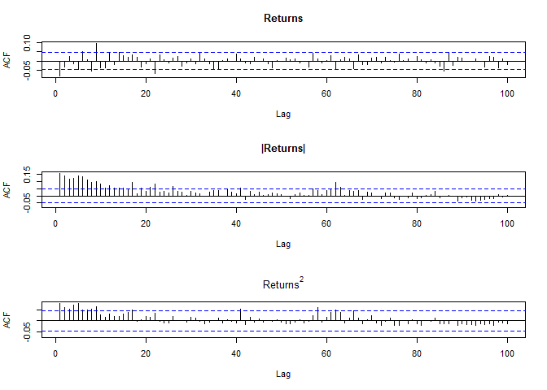<!-- -->

``` r
#rendimenti di tutti i tipi
#decadimento lentissimo
#questo certifica il volatility clustering in termini di autocorr -> eterosch
#nei ^2 e abs si vede che c'? volatilit? -> si vede meglio nei abs


#### Unconditional distribution
par(mfrow = c(1,2))
.hist(x = yret, xlim = c(-10, 10), n = 200, breaks = 200, main = "Returns") #yret[-1] quando uso tutte le oss
qqnorm(y = scale(yret)) #yret[-1] quando uso tutte le oss
abline(a = 0, b = 1, col = "red")
```

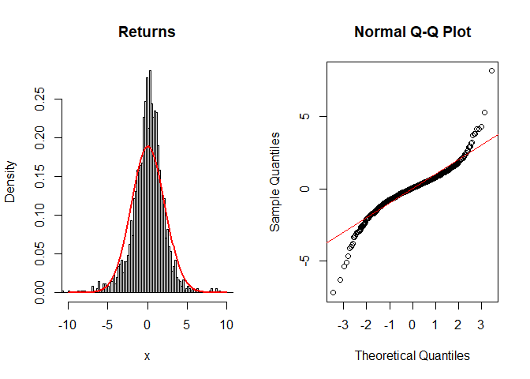<!-- -->

``` r
cat("\nJarque-Bera statistics on log-returns")
```

    ## 
    ## Jarque-Bera statistics on log-returns

``` r
print( jarque.bera.test(x = yret) ) #yret[-1] quando uso tutte le oss
```

    ## 
    ##  Jarque Bera Test
    ## 
    ## data:  yret
    ## X-squared = 4053.5, df = 2, p-value < 2.2e-16

``` r
#### Comment: Normality is highly rejected; the distribution is leptokurtic.
# distrib non condiz dei rendimenti
# forte ipernormalit? (code grandi) -> altra certificazione del volatility
# clustering da un altro punto di vista
# piu simile a student t che normale
```

## ARMA modeling

The best ARMA on returns is ARMA(1,0) (table 12) with standardized
student t distribution of errors.

``` r
####
cat("\n-----------------------------------------------------------------
  ARMA on log-returns\n")
```

    ## 
    ## -----------------------------------------------------------------
    ##   ARMA on log-returns

``` r
#### Now we use package rugarch
##   Try an ARMA and look at the results; try to change distribution
## ARMA(1,0) norm    mu accetto Ho
## ARMA(1,0) std     Akaike       4.134797   Bayes        4.147225   mu rifiuto Ho, tutti i parametri signif e IC pi? bassi
## ARMA(0,1) std     praticamente uguale a (1,0)

#uso ARMA(1,0) std , gli se robusti si alzano tranne per mu che addirittura si abbassa ma di poco
#no skew -> no asimmetria
#? molto diversa dalla normale -> ho shape
#nonostanza std c'? ancora un po di diff tra gli se e gli se robusti


#guardare un po anche i residui ma non importa essere precisi perche c'? tanta eteroshc
# costruisco il modello
spec0 <- arfimaspec(
  mean.model = list(armaOrder = c(1,0), 
                    include.mean = TRUE, external.regressors = NULL), 
  distribution.model = "std" ) 
# c ? tanta leptocurtosi quindi metto std
# mean model modello sulla media p,q
# distr model modello degli errori -> norm o std (student t standardizzata)
# che uso per confrontarla con la normale perche senno avrei media 0 e var df/df-2
# <- la metto in base alla distriub non condiz dei rendimenti
# include mean si mette sempre a TRUE
# ? un arima col d=0 sempre

# stimo il modello
#yret[-1] quando uso tutte le oss
fit0 <- arfimafit(spec = spec0, data = yret, 
                  solver = "solnp")

## Store the number of parameters
np0 <- NROW(fit0@fit$coef)

## Some statistics
cat( "\nInformation Criteria" )
```

    ## 
    ## Information Criteria

``` r
print( infocriteria(fit0) )
```

    ##                      
    ## Akaike       4.134797
    ## Bayes        4.147225
    ## Shibata      4.134787
    ## Hannan-Quinn 4.139390

``` r
#aic e bic che sono valori medi aic/#oss (su arima non sono medi)

cat("\nMatrice coefficienti\n")
```

    ## 
    ## Matrice coefficienti

``` r
print( fit0@fit$matcoef )
```

    ##          Estimate  Std. Error   t value     Pr(>|t|)
    ## mu     0.14496328  0.03740427  3.875581 1.063704e-04
    ## ar1   -0.08989513  0.02106906 -4.266690 1.983949e-05
    ## sigma  2.13518543  0.09283020 23.000977 0.000000e+00
    ## shape  3.59854165  0.32572534 11.047779 0.000000e+00

``` r
#stima coefficienti ovvero il modello stimato
#mu media non condizionata -> R H0 -> stat significativa

cat("\nRobust matcoef\n")
```

    ## 
    ## Robust matcoef

``` r
print( fit0@fit$robust.matcoef )
```

    ##          Estimate  Std. Error   t value     Pr(>|t|)
    ## mu     0.14496328  0.03715019  3.902087 9.536679e-05
    ## ar1   -0.08989513  0.02607008 -3.448210 5.643141e-04
    ## sigma  2.13518543  0.12689134 16.826880 0.000000e+00
    ## shape  3.59854165  0.35343093 10.181740 0.000000e+00

``` r
#stima S.E. robusti, robusti rispetto ad una possibile cattiva spec della distrib degli errori
#estimate identica, cambia l S.E. che aumenta un po di solito

#abbiamo dati fortemente eterosch -> coglierla e modellarla bene
#### Result: yret looks like a WN, implying that y is a RW. Really?

#### ACF of residuals, abs residuals and squared residuals
res <- as.numeric( residuals(fit0) )
par(mfrow = c(3,1))
Acf(x = res, lag.max = 100, type = "correlation", main = "Returns")
Acf(x = abs(res), lag.max = 100, type = "correlation", main = "|res|")
Acf(x = res^2, lag.max = 100, type = "correlation", main = expression(res^2))
```

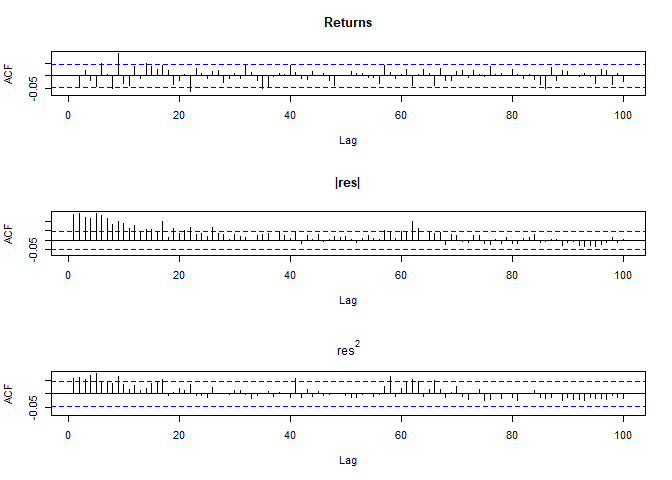<!-- -->

``` r
#### Comments: 
##   1) Large serial correlation of absolute and squared residuals; 
##   2) absolute values are more correlated than squares.
##   eteroschedasticit? ? rimasta anche dopo il tentativo di modificare i dati
#   l'obiettivo ? quello di modellare la volatilit?: nei mercati fin pi? ? alta e + c? rischi
#   per prevedere il rischio, da un punto di vista stat -> + volatilit? indica bande piu larghe
#   io meno ne ho meglio ?
##   Conclusion: residuals are not WN. Since residuals are similar to the 
##   original time series, the original too is not a WN.
```

## ARCH and GARCH modeling

In order to model volatility, various GARCH-type models are adopted
starting from simple-GARCH (sGARCH), the simplest.

``` r
####
cat("\n-----------------------------------------------------------------
  GARCH on log-returns\n")
```

    ## 
    ## -----------------------------------------------------------------
    ##   GARCH on log-returns

``` r
#### Simple GARCH
spec1 <- ugarchspec(
  variance.model = list(model = "sGARCH", garchOrder = c(1,1), 
                        submodel = NULL, external.regressors = NULL, variance.targeting = FALSE), 
  mean.model = list(armaOrder = c(1,0), include.mean = TRUE,  
                    external.regressors = NULL), 
  distribution.model = "std")
fit1 <- ugarchfit(spec = spec1, data = yret, solver = "solnp") #yret[-1] quando uso tutte le oss
## Store the number of parameters
np1 <- NROW(fit1@fit$coef)
## Some statistics
cat( "\nInformation Criteria" )
```

    ## 
    ## Information Criteria

``` r
print( infocriteria(fit1) )
```

    ##                      
    ## Akaike       4.083470
    ## Bayes        4.102111
    ## Shibata      4.083447
    ## Hannan-Quinn 4.090359

``` r
cat("\nMatcoef\n")
```

    ## 
    ## Matcoef

``` r
print( fit1@fit$matcoef )
```

    ##           Estimate  Std. Error   t value     Pr(>|t|)
    ## mu      0.16031128  0.03619380  4.429247 9.456284e-06
    ## ar1    -0.06724427  0.02375963 -2.830190 4.652039e-03
    ## omega   0.32272135  0.09876292  3.267637 1.084494e-03
    ## alpha1  0.10332267  0.02631690  3.926096 8.633558e-05
    ## beta1   0.82617634  0.03966215 20.830347 0.000000e+00
    ## shape   4.27591533  0.42751640 10.001758 0.000000e+00

``` r
cat("\nRobust matcoef\n")
```

    ## 
    ## Robust matcoef

``` r
print( fit1@fit$robust.matcoef )
```

    ##           Estimate  Std. Error   t value     Pr(>|t|)
    ## mu      0.16031128  0.03538001  4.531126 5.867024e-06
    ## ar1    -0.06724427  0.02424906 -2.773067 5.553069e-03
    ## omega   0.32272135  0.11298132  2.856413 4.284569e-03
    ## alpha1  0.10332267  0.03640286  2.838312 4.535284e-03
    ## beta1   0.82617634  0.05162429 16.003637 0.000000e+00
    ## shape   4.27591533  0.47097146  9.078927 0.000000e+00

``` r
#### Diagnostics: Use standardized residuals!
fit <- fit1
par(mfrow = c(3,1))
Acf(x = fit@fit$z,      lag.max = 100, type = "correlation", main = "z")
Acf(x = abs(fit@fit$z), lag.max = 100, type = "correlation", main = "|z|")
Acf(x = fit@fit$z^2,    lag.max = 100, type = "correlation", main = expression(z^2))
```

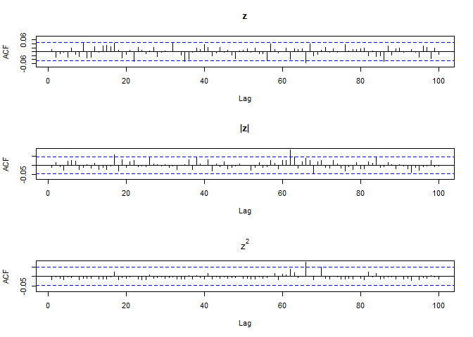<!-- -->

``` r
lag1 <- np1 + c(1, 2, 5, 10, 15, 20)
cat("\nLjung-Box on standardized residuals:\n")
```

    ## 
    ## Ljung-Box on standardized residuals:

``` r
lb1 <- mapply(FUN = Box.test, lag = lag1, 
              MoreArgs = list(x = fit@fit$z, type = "Ljung-Box", fitdf = np1) )
print(rbind(lag = lag1, lb1[1:3,]))
```

    ##           [,1]       [,2]      [,3]       [,4]       [,5]       [,6]      
    ## lag       7          8         11         16         21         26        
    ## statistic 4.079096   4.98637   11.7638    17.48893   23.39103   28.64748  
    ## parameter 1          2         5          10         15         20        
    ## p.value   0.04341689 0.0826463 0.03817154 0.06422136 0.07618318 0.09493619

``` r
cat("\nLjung-Box on |standardized residuals|\n")
```

    ## 
    ## Ljung-Box on |standardized residuals|

``` r
lb1 <- mapply(FUN = Box.test, lag = lag1, 
              MoreArgs = list(x = abs(fit@fit$z), type = "Ljung-Box", fitdf = np1) )
print(rbind(lag = lag1, lb1[1:3,]))
```

    ##           [,1]       [,2]       [,3]      [,4]      [,5]      [,6]     
    ## lag       7          8          11        16        21        26       
    ## statistic 5.583806   6.41911    7.200431  9.673751  20.49929  25.50196 
    ## parameter 1          2          5         10        15        20       
    ## p.value   0.01812729 0.04037457 0.2061557 0.4695672 0.1536042 0.1828974

``` r
cat("\nLjung-Box on standardized residuals^2:\n")
```

    ## 
    ## Ljung-Box on standardized residuals^2:

``` r
lb1 <- mapply(FUN = Box.test, lag = lag1, 
              MoreArgs = list(x = fit@fit$z^2, type = "Ljung-Box", fitdf = np1) )
print(rbind(lag = lag1, lb1[1:3,]))
```

    ##           [,1]     [,2]      [,3]      [,4]      [,5]      [,6]     
    ## lag       7        8         11        16        21        26       
    ## statistic 1.109328 1.615298  2.097376  2.970336  4.67802   6.156788 
    ## parameter 1        2         5         10        15        20       
    ## p.value   0.292228 0.4459052 0.8355138 0.9821136 0.9945193 0.9986686

``` r
#### ARCH test
cat("\nARCH test on standardized residuals\n")
```

    ## 
    ## ARCH test on standardized residuals

``` r
lag <- c(4, 8, 12, 16)
at <- mapply(FUN = ArchTest, lags = lag, 
             MoreArgs = list(x = fit1@fit$z, demean = TRUE))
print(at[1:3,])
```

    ##           [,1]      [,2]      [,3]      [,4]     
    ## statistic 1.11123   1.682912  2.204835  3.20409  
    ## parameter 4         8         12        16       
    ## p.value   0.8924864 0.9892387 0.9990213 0.9997374

``` r
#### Comment: Varianza molto stabile

par(mfrow = c(1,2))
xlim <- c(-5, 5)
.hist.fit(fit = fit1, xlim = xlim, ylim = c(0,0.55), n = 200, breaks = 100, 
          plot.norm = TRUE, main = "")
.qqplot.fit(fit = fit1)
```

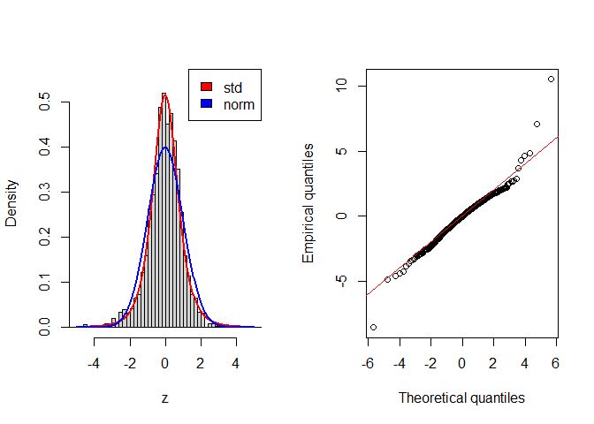<!-- -->

``` r
#### Leverage check
cat("\nSign bias test\n")
```

    ## 
    ## Sign bias test

``` r
print( signbias(fit1) )
```

    ##                      t-value      prob sig
    ## Sign Bias          0.6318618 0.5275594    
    ## Negative Sign Bias 0.3560575 0.7218402    
    ## Positive Sign Bias 0.5356643 0.5922583    
    ## Joint Effect       0.4823431 0.9227531

``` r
# accetto tutto e non ho nessuna asimmetria
# ? affidabile? cambiamo il modello garch mettendogli asimmetria
```

CIs are better than ARMA(1,0) and all coefficients are highly
significant. Before moving on to the GJR-GARCH specification, a model
analogous to the sGARCH with the addition of a term that presents a
possible asymmetric behavior of the conditional variance, it is
necessary to test that the data actually present this asymmetric
component with the tests of signs which seems to exclude an asymmetry
effect.

The estimated GJR-GARCH(1,1) (Table 15) contradicts this result: it has
slightly lower CIs than the sGARCH(1,1) model.

``` r
#### GJR GARCH
#### This can be verified in an explicit modeling -> gjrGARCH in place of sGARCH
spec2 <- ugarchspec(
  variance.model = list(model = "gjrGARCH", garchOrder = c(1, 1), 
                        submodel = NULL, external.regressors = NULL, variance.targeting = FALSE), 
  mean.model = list(armaOrder = c(1, 0), include.mean = TRUE, 
                    external.regressors = NULL), distribution.model = "std")
fit2 <- ugarchfit(spec = spec2, data = yret, solver = "solnp") #yret[-1] quando uso tutte le oss
## Store the number of parameters
np2 <- NROW(fit2@fit$coef)
## Some statistics
cat( "\nInformation Criteria" )
```

    ## 
    ## Information Criteria

``` r
print( infocriteria(fit2) )
```

    ##                      
    ## Akaike       4.068428
    ## Bayes        4.090175
    ## Shibata      4.068396
    ## Hannan-Quinn 4.076464

``` r
#sono migliorati?

cat("\nMatcoef\n")
```

    ## 
    ## Matcoef

``` r
print( fit2@fit$matcoef )
```

    ##             Estimate  Std. Error       t value     Pr(>|t|)
    ## mu      1.408620e-01  0.03558101  3.958909e+00 7.529296e-05
    ## ar1    -7.920399e-02  0.02272116 -3.485914e+00 4.904590e-04
    ## omega   2.220474e-01  0.06742659  3.293173e+00 9.906344e-04
    ## alpha1  1.131058e-08  0.00701008  1.613474e-06 9.999987e-01
    ## beta1   8.773772e-01  0.02654602  3.305118e+01 0.000000e+00
    ## gamma1  1.352632e-01  0.02989647  4.524388e+00 6.057063e-06
    ## shape   4.326206e+00  0.43367999  9.975573e+00 0.000000e+00

``` r
cat("\nRobust matcoef\n")
```

    ## 
    ## Robust matcoef

``` r
print( fit2@fit$robust.matcoef )
```

    ##             Estimate  Std. Error       t value     Pr(>|t|)
    ## mu      1.408620e-01 0.035724717  3.942984e+00 8.047396e-05
    ## ar1    -7.920399e-02 0.025682713 -3.083942e+00 2.042777e-03
    ## omega   2.220474e-01 0.099315174  2.235786e+00 2.536582e-02
    ## alpha1  1.131058e-08 0.006814372  1.659813e-06 9.999987e-01
    ## beta1   8.773772e-01 0.041203998  2.129350e+01 0.000000e+00
    ## gamma1  1.352632e-01 0.040608812  3.330884e+00 8.657071e-04
    ## shape   4.326206e+00 0.454063988  9.527746e+00 0.000000e+00

``` r
#alpha1 non significativo -> coeff associato al termine Ut-1
#come previsto il coeff gamma1 è positivo (si vede dal grafico) 
#ed ? signif in entrambe le versioni
```

The coefficient associated with the “leverage” effect (gamma1) is highly
significant (see also the NIC (News Impact Curve)). Obtained as a
special case of the Family-GARCH, the T-GARCH model is estimated:

``` r
################################################################################
## Alternative GARCH formulations via fGARCH: GJRGARCH and T-GARCH
################################################################################

# tgarch si usa nella magg parte dei casi

#### GJR using fGARCH
spec4 <- ugarchspec(
  variance.model = list(model = "fGARCH", garchOrder = c(1, 1), 
                        submodel = "GJRGARCH", external.regressors = NULL, variance.targeting = FALSE),  
  mean.model = list(armaOrder = c(1,0), include.mean = TRUE,  
                    external.regressors = NULL), 
  distribution.model = "std")
fit4 <- ugarchfit(spec = spec4, data = yret, solver = "solnp")
## Store the number of parameters
np4 <- NROW(fit4@fit$coef)

#### Conversion to the "traditional" GJR form
fit4c <- .fgarch.2.gjr(fit = fit4)

#### Comparison
cat("\n\ngjrGARCH vs fGARCH(GJRGARCH)\n")
```

    ## 
    ## 
    ## gjrGARCH vs fGARCH(GJRGARCH)

``` r
cat("Direct GJR\n")
```

    ## Direct GJR

``` r
print( infocriteria(fit2) )
```

    ##                      
    ## Akaike       4.068428
    ## Bayes        4.090175
    ## Shibata      4.068396
    ## Hannan-Quinn 4.076464

``` r
print(fit2@fit$robust.matcoef)
```

    ##             Estimate  Std. Error       t value     Pr(>|t|)
    ## mu      1.408620e-01 0.035724717  3.942984e+00 8.047396e-05
    ## ar1    -7.920399e-02 0.025682713 -3.083942e+00 2.042777e-03
    ## omega   2.220474e-01 0.099315174  2.235786e+00 2.536582e-02
    ## alpha1  1.131058e-08 0.006814372  1.659813e-06 9.999987e-01
    ## beta1   8.773772e-01 0.041203998  2.129350e+01 0.000000e+00
    ## gamma1  1.352632e-01 0.040608812  3.330884e+00 8.657071e-04
    ## shape   4.326206e+00 0.454063988  9.527746e+00 0.000000e+00

``` r
cat("GJR via fGARCH\n")
```

    ## GJR via fGARCH

``` r
print( infocriteria(fit4) )
```

    ##                      
    ## Akaike       4.068428
    ## Bayes        4.090175
    ## Shibata      4.068396
    ## Hannan-Quinn 4.076464

``` r
print(fit4c$robust.matcoef)
```

    ##             Estimate   Std. Error    t value     Pr(>|t|)
    ## mu      1.408501e-01 3.572732e-02  3.9423650 8.068206e-05
    ## ar1    -7.918403e-02 2.495840e-02 -3.1726398 1.510598e-03
    ## omega   2.219963e-01 9.691699e-02  2.2905815 2.198763e-02
    ## alpha1  3.424963e-08 2.505195e-07  0.1367144 8.912565e-01
    ## beta1   8.773602e-01 3.837333e-02 22.8637996 0.000000e+00
    ## gamma1  1.352935e-01 4.131032e-02  3.2750540 1.056418e-03
    ## shape   4.326810e+00 4.538131e-01  9.5343427 0.000000e+00

``` r
#confrontare questi output tra i 2 modelli


#### TGARCH (using fGARCH) 
spec5 <- ugarchspec(
  variance.model = list(model = "fGARCH", garchOrder = c(1, 1), 
                        submodel = "TGARCH", external.regressors = NULL, variance.targeting = FALSE),  
  mean.model = list(armaOrder = c(1, 0), include.mean = TRUE, 
                    external.regressors = NULL), 
  distribution.model = "std")
fit5 <- ugarchfit(spec = spec5, data = yret, solver = "solnp")

## Store the number of parameters
np5 <- NROW(fit5@fit$coef)

#### Conversion to the "traditional" GJR form
fit5c <- .fgarch.2.gjr(fit = fit5)

#### Coefficient comparison
cat("\n\nGJR-GARCH vs T-GARCH\n")
```

    ## 
    ## 
    ## GJR-GARCH vs T-GARCH

``` r
cat("GJR-GARCH\n")
```

    ## GJR-GARCH

``` r
print( infocriteria(fit4) )
```

    ##                      
    ## Akaike       4.068428
    ## Bayes        4.090175
    ## Shibata      4.068396
    ## Hannan-Quinn 4.076464

``` r
print(fit4c$robust.matcoef)
```

    ##             Estimate   Std. Error    t value     Pr(>|t|)
    ## mu      1.408501e-01 3.572732e-02  3.9423650 8.068206e-05
    ## ar1    -7.918403e-02 2.495840e-02 -3.1726398 1.510598e-03
    ## omega   2.219963e-01 9.691699e-02  2.2905815 2.198763e-02
    ## alpha1  3.424963e-08 2.505195e-07  0.1367144 8.912565e-01
    ## beta1   8.773602e-01 3.837333e-02 22.8637996 0.000000e+00
    ## gamma1  1.352935e-01 4.131032e-02  3.2750540 1.056418e-03
    ## shape   4.326810e+00 4.538131e-01  9.5343427 0.000000e+00

``` r
cat("T-GARCH\n")
```

    ## T-GARCH

``` r
print( infocriteria(fit5) )
```

    ##                      
    ## Akaike       4.062516
    ## Bayes        4.084263
    ## Shibata      4.062484
    ## Hannan-Quinn 4.070552

``` r
print(fit5c$robust.matcoef)
```

    ##           Estimate  Std. Error   t value     Pr(>|t|)
    ## mu      0.13383993  0.03560369  3.759159 0.0001704856
    ## ar1    -0.07171283  0.02209787 -3.245237 0.0011735280
    ## omega   0.10139953  0.03300704  3.072058 0.0021258859
    ## alpha1  0.03208596  0.02409900  1.331423 0.1830499650
    ## beta1   0.88464996  0.02909388 30.406738 0.0000000000
    ## gamma1  0.11006211  0.02859328  3.849230 0.0001184897
    ## shape   4.46090036  0.48836320  9.134391 0.0000000000

``` r
#IC piu bassi nel tgarch ma p-value leggermente alzati

#### Compare the News Impact Curves (sGARCH vs gjrGARCH vs TGARCH) 
ni1 <- newsimpact(z = NULL, fit1)
ni2 <- newsimpact(z = NULL, fit2)
ni5 <- newsimpact(z = NULL, fit5)
legend <- c("Simple-GARCH", "GJR-GARCH", "T-GARCH")
col  <- c("black", "red", "blue")
ylim <- range( ni1$zy, ni2$zy, ni5$zy)
par(mfrow = c(1,1), mar = c(4, 4.5, 3, 1) + 0.1)
plot(x = ni1$zx, y = ni1$zy, ylab = ni1$yexpr, xlab = ni1$xexpr, type = "l", 
     ylim = ylim, main = "News Impact Curve", col = col[1])
lines(x = ni2$zx, y = ni2$zy, col = col[2])
lines(x = ni5$zx, y = ni5$zy, col = col[3])
legend(x = "topright", y = NULL, legend = legend, border = FALSE, col = col, 
       lty = 1, text.col = col)
```

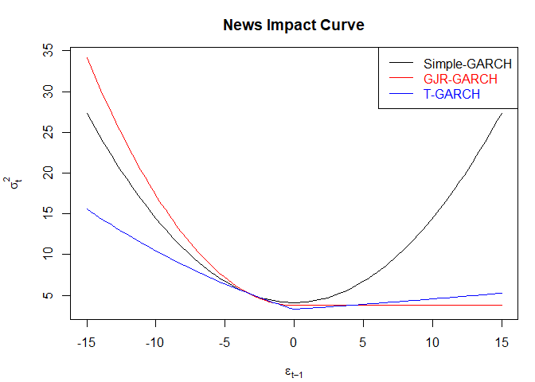<!-- -->

``` r
#### Stability check
cat("\nStability check (Nyblom test)\n")
```

    ## 
    ## Stability check (Nyblom test)

``` r
print( nyblom(fit5) )
```

    ## $IndividualStat
    ##             [,1]
    ## mu     0.0765550
    ## ar1    0.1128225
    ## omega  0.3434348
    ## alpha1 0.2408769
    ## beta1  0.3300493
    ## eta11  0.6133600
    ## shape  0.2500094
    ## 
    ## $JointStat
    ## [1] 1.289422
    ## 
    ## $IndividualCritical
    ##   10%    5%    1% 
    ## 0.353 0.470 0.748 
    ## 
    ## $JointCritical
    ##  10%   5%   1% 
    ## 1.69 1.90 2.35

``` r
#statistiche singole e statistiche congiunte e guardo rispetto ai valori critici
#di tutti questi parametri l unico stabile ? mu (mu < tutti i cval individuali)
# se stattest > cval -> parametro non stabile
## Comment: stability is rejected -> reduce the length of the series to 2015
#diminuendo le oss i parametri sono stabili -> sigma^2 j = 0


#### Use standardized residuals!
#uso il t garch perch? le differenze sono veramente minime
fit <- fit5
par(mfrow = c(3,1))
Acf(x = fit@fit$z, lag.max = 100, type = "correlation", main = "Residui standardizzati")
Acf(x = abs(fit@fit$z), lag.max = 100, type = "correlation", main = "Residui standardizzati in valore assoluto")
Acf(x = fit@fit$z^2, lag.max = 100, type = "correlation", main = "Residui standardizzati al quadrato")
```

<!-- -->

``` r
cat("\nLjung-Box statistics on z residuals\n")
```

    ## 
    ## Ljung-Box statistics on z residuals

``` r
lag1 <- np5 + c(1, 2, 5, 10, 15, 20)
cat("\nLjung-Box on standardized residuals:\n")
```

    ## 
    ## Ljung-Box on standardized residuals:

``` r
lb1 <- mapply(FUN = Box.test, lag = lag1, 
              MoreArgs = list(x = fit@fit$z, type = "Ljung-Box", fitdf = np5) )
print(rbind(lag = lag1, lb1[1:3,]))
```

    ##           [,1]       [,2]       [,3]       [,4]       [,5]       [,6]      
    ## lag       8          9          12         17         22         27        
    ## statistic 5.79413    9.192854   13.66523   21.8104    28.4878    30.04746  
    ## parameter 1          2          5          10         15         20        
    ## p.value   0.01607977 0.01008781 0.01788173 0.01610019 0.01870755 0.06908835

``` r
cat("\nLjung-Box statistics on |z residuals|\n")
```

    ## 
    ## Ljung-Box statistics on |z residuals|

``` r
lb1 <- mapply(FUN = Box.test, lag = lag1, 
              MoreArgs = list(x = abs(fit@fit$z), type = "Ljung-Box", fitdf = np5) )
print(rbind(lag = lag1, lb1[1:3,]))
```

    ##           [,1]       [,2]       [,3]      [,4]       [,5]       [,6]     
    ## lag       8          9          12        17         22         27       
    ## statistic 5.073308   5.492713   6.245992  16.56302   22.65442   26.12174 
    ## parameter 1          2          5         10         15         20       
    ## p.value   0.02429697 0.06416119 0.2830134 0.08460998 0.09175785 0.1618287

``` r
cat("\nLjung-Box statistics on (z residuals)^2\n")
```

    ## 
    ## Ljung-Box statistics on (z residuals)^2

``` r
lb1 <- mapply(FUN = Box.test, lag = lag1, 
              MoreArgs = list(x = fit@fit$z^2, type = "Ljung-Box", fitdf = np5) )
print(rbind(lag = lag1, lb1[1:3,]))
```

    ##           [,1]      [,2]      [,3]      [,4]      [,5]      [,6]     
    ## lag       8         9         12        17        22        27       
    ## statistic 1.273935  1.320364  1.868456  3.820555  4.885224  6.459754 
    ## parameter 1         2         5         10        15        20       
    ## p.value   0.2590297 0.5167572 0.8670308 0.9550791 0.9930544 0.9981168

``` r
#### ARCH test
cat("\nARCH test on standardized residuals\n")
```

    ## 
    ## ARCH test on standardized residuals

``` r
lag <- c(4, 8, 12, 16)
at <- mapply(FUN = ArchTest, lags = lag, 
             MoreArgs = list(x = fit@fit$z, demean = TRUE))
print(at[1:3,])
```

    ##           [,1]      [,2]      [,3]      [,4]     
    ## statistic 0.7946968 1.23498   1.852772  2.864086 
    ## parameter 4         8         12        16       
    ## p.value   0.9391576 0.9962842 0.9996005 0.9998758

``` r
#### Comment: Varianza molto stabile


#### Stability check
cat("\nStability check (Nyblom test)\n")
```

    ## 
    ## Stability check (Nyblom test)

``` r
print( nyblom(fit5) )
```

    ## $IndividualStat
    ##             [,1]
    ## mu     0.0765550
    ## ar1    0.1128225
    ## omega  0.3434348
    ## alpha1 0.2408769
    ## beta1  0.3300493
    ## eta11  0.6133600
    ## shape  0.2500094
    ## 
    ## $JointStat
    ## [1] 1.289422
    ## 
    ## $IndividualCritical
    ##   10%    5%    1% 
    ## 0.353 0.470 0.748 
    ## 
    ## $JointCritical
    ##  10%   5%   1% 
    ## 1.69 1.90 2.35

``` r
#statistiche singole e statistiche congiunte e guardo rispetto ai valori critici
#di tutti questi parametri l unico stabile ? mu (mu < tutti i cval individuali)
# se stattest > cval -> parametro non stabile
## Comment: stability is rejected -> reduce the length of the series to 2015
#diminuendo le oss i parametri sono stabili -> sigma^2 j = 0


#### Independence test on ln(|standardized residuals|)
x1 <- log( abs(fit@fit$z) )
bds <- bds.test(x = x1, m = 4, 
                eps = seq(from = 0.5 * sd(x1), to = 2 * sd(x1), length = 4),
                trace = FALSE)
cat("BDS test on log(abs(z residuals))\n")
```

    ## BDS test on log(abs(z residuals))

``` r
print(bds)
```

    ## 
    ##   BDS Test 
    ## 
    ## data:  x1 
    ## 
    ## Embedding dimension =  2 3 4 
    ## 
    ## Epsilon for close points =  0.5798 1.1596 1.7394 2.3191 
    ## 
    ## Standard Normal = 
    ##       [ 0.5798 ] [ 1.1596 ] [ 1.7394 ] [ 2.3191 ]
    ## [ 2 ]    -1.3038    -0.6705    -0.1822    -0.2915
    ## [ 3 ]    -1.1255    -0.3828     0.0683    -0.2773
    ## [ 4 ]    -0.6237    -0.0215     0.3061    -0.1418
    ## 
    ## p-value = 
    ##       [ 0.5798 ] [ 1.1596 ] [ 1.7394 ] [ 2.3191 ]
    ## [ 2 ]     0.1923     0.5026     0.8554     0.7707
    ## [ 3 ]     0.2604     0.7019     0.9455     0.7815
    ## [ 4 ]     0.5329     0.9829     0.7595     0.8872

``` r
#### Comment: returns are i.i.d.
# tutti i p-value > 0.05
```

Usually this model is the one that best fits the data: in this case we
observe even lower CIs than the GJR-GARCH. Graph shows the NIC of the
estimated GARCH models: the curves show the impact of Ut-1 news versus
the conditional variance. In sGARCH the conditional variance does not
react asymmetrically with respect to Ut-1, the opposite of what happens
in the other two models.

## NIC and Variance targeting

``` r
#### Compare the News Impact Curves (sGARCH vs gjrGARCH) 
ni1 <- newsimpact(z = NULL, fit1)
ni2 <- newsimpact(z = NULL, fit2)
legend <- c("Simple-GARCH", "GJR-GARCH")
col  <- c("black", "red")
ylim <- range( ni1$zy, ni2$zy )
par(mfrow = c(1,1), mar = c(4, 4.5, 3, 1) + 0.1, lwd = 2)
plot(x = ni1$zx, y = ni1$zy, ylab = ni1$yexpr, xlab = ni1$xexpr, type = "l", 
     ylim = ylim, main = "News Impact Curve", col = col[1])
lines(x = ni2$zx, y = ni2$zy, col = col[2], lwd = 2)
legend(x = "topright", y = NULL, legend = legend, border = FALSE, col = col, 
       lty = 1, text.col = col)
```

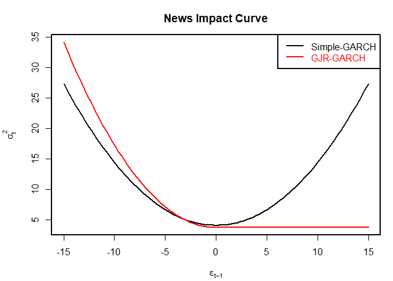<!-- -->

``` r
################################################################################
## Stationarity and Variance Targeting
################################################################################

#### Include variance targeting in GJR
spec3 <- ugarchspec(variance.model = list(model = "gjrGARCH", garchOrder = c(1, 1), 
                                          submodel = NULL, external.regressors = NULL, variance.targeting = TRUE),  
                    mean.model = list(armaOrder = c(1, 0), include.mean = TRUE, 
                                      external.regressors = NULL), distribution.model = "std")
fit3 <- ugarchfit(spec = spec3, data = yret, solver = "solnp")
## Store the number of parameters
np3 <- NROW(fit3@fit$coef)

#### Compare the two fits
cat("\nGJR without VT\n")
```

    ## 
    ## GJR without VT

``` r
print( infocriteria(fit2) )
```

    ##                      
    ## Akaike       4.068428
    ## Bayes        4.090175
    ## Shibata      4.068396
    ## Hannan-Quinn 4.076464

``` r
print(fit2@fit$robust.matcoef)
```

    ##             Estimate  Std. Error       t value     Pr(>|t|)
    ## mu      1.408620e-01 0.035724717  3.942984e+00 8.047396e-05
    ## ar1    -7.920399e-02 0.025682713 -3.083942e+00 2.042777e-03
    ## omega   2.220474e-01 0.099315174  2.235786e+00 2.536582e-02
    ## alpha1  1.131058e-08 0.006814372  1.659813e-06 9.999987e-01
    ## beta1   8.773772e-01 0.041203998  2.129350e+01 0.000000e+00
    ## gamma1  1.352632e-01 0.040608812  3.330884e+00 8.657071e-04
    ## shape   4.326206e+00 0.454063988  9.527746e+00 0.000000e+00

``` r
cat("\nGJR with VT\n")
```

    ## 
    ## GJR with VT

``` r
print( infocriteria(fit3) )
```

    ##                      
    ## Akaike       4.067470
    ## Bayes        4.086111
    ## Shibata      4.067447
    ## Hannan-Quinn 4.074359

``` r
print(fit3@fit$robust.matcoef)
```

    ##             Estimate  Std. Error       t value     Pr(>|t|)
    ## mu      1.373972e-01 0.034898377  3.937067e+00 8.248375e-05
    ## ar1    -7.902522e-02 0.025995036 -3.040012e+00 2.365687e-03
    ## alpha1  1.374297e-07 0.007501248  1.832091e-05 9.999854e-01
    ## beta1   8.765858e-01 0.047809996  1.833478e+01 0.000000e+00
    ## gamma1  1.441035e-01 0.043631201  3.302764e+00 9.573709e-04
    ## shape   4.158517e+00 0.375261635  1.108165e+01 0.000000e+00
    ## omega   2.277302e-01          NA            NA           NA

- The y-axis represents conditional variations.

- The x-axis corresponds to Ut-1.

- The curve depicting the impact of news (Ut-1) is influenced by
  yesterday’s market performance. If it performed well, the line is \>0;
  otherwise, it is \<0.

- In the case of the simple GARCH (black curve), there is no asymmetry,
  and it forms a parabolic shape.

- On the other hand, for the GJR-GARCH (red curve), there is asymmetry.
  It reacts much more swiftly to negative news compared to positive
  news, where its response is essentially constant.

- When Ut-1 = 0, the curves have a value close to 5, illustrating the
  reaction of conditional variance to Ut-1.

- It can be concluded that some Ut-1 news has an excessive influence on
  returns.

- Activision, in particular, reacts sharply to this news and likely also
  to other market-related events, as demonstrated in the NIC (News
  Impact Curve). Alpha is a measure of market sensitivity to news, and
  Alpha is zero relative to Beta. Therefore, the reaction of conditional
  volatility to news is relatively contained.

Let’s move on to the IGARCH:

``` r
################################################################################
## Alternative GARCH specifications: iGARCH
################################################################################
#in cui non c ? la componente di asimmetria
#staz in senso forte ma non in senso debole quindi non si pu? usare variance targeting

#### IGARCH 
spec6 <- ugarchspec(variance.model = list(model = "iGARCH", garchOrder = c(1, 1), 
                                          submodel = NULL, external.regressors = NULL, variance.targeting = FALSE),  
                    mean.model = list(armaOrder = c(0, 0), include.mean = TRUE, 
                                      external.regressors = NULL), distribution.model = "std")
fit6 <- ugarchfit(spec = spec6, data = yret, solver = "solnp")
## Store the number of parameters
np6 <- NROW(fit6@fit$coef)
## Some statistics
cat( "\nInformation Criteria" )
```

    ## 
    ## Information Criteria

``` r
print( infocriteria(fit6) )
```

    ##                      
    ## Akaike       4.093164
    ## Bayes        4.105591
    ## Shibata      4.093154
    ## Hannan-Quinn 4.097756

``` r
cat("\nMatcoef\n")
```

    ## 
    ## Matcoef

``` r
print( fit6@fit$matcoef )
```

    ##         Estimate  Std. Error   t value     Pr(>|t|)
    ## mu     0.1668748  0.03797696  4.394107 1.112292e-05
    ## omega  0.2455451  0.08919765  2.752820 5.908443e-03
    ## alpha1 0.1698579  0.03754041  4.524668 6.049046e-06
    ## beta1  0.8301421          NA        NA           NA
    ## shape  3.5209391  0.28606298 12.308265 0.000000e+00

``` r
cat("\nRobust matcoef\n")
```

    ## 
    ## Robust matcoef

``` r
print( fit6@fit$robust.matcoef )
```

    ##         Estimate  Std. Error   t value     Pr(>|t|)
    ## mu     0.1668748  0.03861495  4.321508 1.549665e-05
    ## omega  0.2455451  0.10569714  2.323100 2.017376e-02
    ## alpha1 0.1698579  0.04670338  3.636951 2.758840e-04
    ## beta1  0.8301421          NA        NA           NA
    ## shape  3.5209391  0.31478619 11.185176 0.000000e+00

``` r
## Check alpha1 + beta1 = 1
```

## **Forecasting Evaluation**

**Overview:**

1.  We assess the forecasting accuracy of the GARCH model by comparing
    its volatility estimates with an external benchmark, the
    Garman-Klass volatility. This benchmark provides a less noisy
    measure of volatility compared to squared returns. It’s important to
    note that GARCH models primarily focus on modeling squared or
    absolute returns.

2.  The following section presents In-Sample (IS) forecasts, where the
    forecasting period is within the estimation period. It’s worth
    noting that for a more robust evaluation, Out-of-Sample (OOS)
    forecasts should be considered and compared.

- Comparing Garman-Klass (GK) to absolute returns:

  - GK exhibits behavior similar to absolute returns but with slightly
    more precision.

  - Absolute returns, on the other hand, tend to be a bit noisier.

  - GK will serve as the benchmark and reference point.

- The formula y = sqrt(2/pi) \* abs(yret) represents the sample standard
  deviation. It is a biased estimator of the true standard deviation.
  Therefore, when dealing with normally distributed returns, it is used
  to correct for this bias and obtain an unbiased estimate.

``` r
#### EX-POST
#ex post h fissato e j si muove

#### External benchmark
y  <- data$gkVol * 100

#### To give an idea
par(mfrow=c(2,1), lwd=1)
plot(x=time, y=y, type="l", main="Garman-Klass volatility measure", ylab="")
plot(x=time, y=sqrt(2/pi)*abs(yret) ,type="l" ,main="absolute returns" ,ylab="")
```

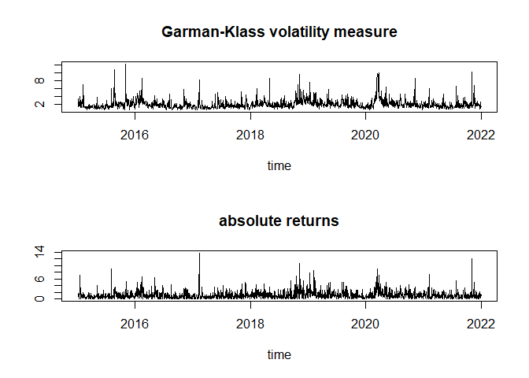<!-- -->

``` r
#### To give an idea
par(mfrow = c(1,1), lwd = 1)
plot(x = time, y = y, type = "l", ylab = "Garman-Klass volatility measure")
lines(x = time, y = fit5@fit$sigma, col = "red")
lines(x = time, y = fit6@fit$sigma, col = "blue")
legend("topright", inset=0, title="Volatility measure:", 
       legend=c("Garman-Klass","T-GARCH", "I-GARCH"), 
       col=c("black","red","blue"), lty=1, cex=0.70)
```

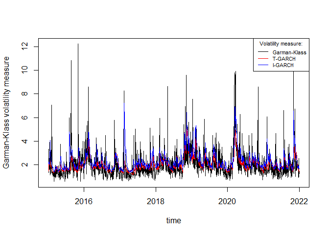<!-- -->

``` r
#met? 2020 e 2017 non seguono bene, in generale senno sembrerebbero seguire bene la proxy

#### Set naive -> 2 naive differenti
naive.vol <- sd(yret) #dev std dei rendimenti (volatilit?)
naive.var <- naive.vol^2 #var campionaria, posso usarla perche ho stazionarieta col naive
```

In general, the two models seem to follow the proxy in figure \[17\]
quite well, there is some slight more marked difference only towards
mid-2017 and at the peak of 2020. To evaluate which model is the best
among the four, in the table the comparison of the error measures for
both volatility and variance:

``` r
#### Error measures
cat("---------------------------------------------------------------------", 
    "\nError measures\n")
```

    ## --------------------------------------------------------------------- 
    ## Error measures

``` r
ErrorMeas <- data.frame(
  measure = c("Volatility", "Volatility", "Volatility", "Volatility", 
              "Variance", "Variance", "Variance", "Variance"), 
  model = c("GARCH", "GJR-GARCH", "T-GARCH", "IGARCH", 
            "GARCH", "GJR-GARCH", "T-GARCH", "IGARCH"), 
  rbind( 
    .ErrorMeasures(y = y,   fit = fit1@fit$sigma,   naive = naive.vol), 
    .ErrorMeasures(y = y,   fit = fit2@fit$sigma,   naive = naive.vol), 
    .ErrorMeasures(y = y,   fit = fit5@fit$sigma,   naive = naive.vol), 
    .ErrorMeasures(y = y,   fit = fit6@fit$sigma,   naive = naive.vol), 
    .ErrorMeasures(y = y^2, fit = fit1@fit$sigma^2, naive = naive.var), 
    .ErrorMeasures(y = y^2, fit = fit2@fit$sigma^2, naive = naive.var), 
    .ErrorMeasures(y = y^2, fit = fit5@fit$sigma^2, naive = naive.var), 
    .ErrorMeasures(y = y^2, fit = fit6@fit$sigma^2, naive = naive.var) ) ) 
print( ErrorMeas )
```

    ##      measure     model           ME       MAE     RMSE        MPE      MAPE
    ## 1 Volatility     GARCH -0.030913241 0.6637872 1.043108 -0.1882076 0.3619786
    ## 2 Volatility GJR-GARCH -0.028410874 0.6609973 1.049566 -0.1747667 0.3519942
    ## 3 Volatility   T-GARCH -0.003997841 0.6401351 1.015603 -0.1594691 0.3385602
    ## 4 Volatility    IGARCH -0.281851021 0.7639596 1.121352 -0.3151122 0.4414605
    ## 5   Variance     GARCH  0.866301396 3.4715934 9.095685 -0.6330427 0.9181190
    ## 6   Variance GJR-GARCH  0.774249379 3.5075288 9.183034 -0.5880195 0.8782035
    ## 7   Variance   T-GARCH  0.948007579 3.3567609 8.992451 -0.5277018 0.8209323
    ## 8   Variance    IGARCH -0.552326025 4.0805228 9.249278 -1.0265139 1.2352381
    ##       RMSPE     ScMAE    ScRMSE
    ## 1 0.5065843 0.8658972 0.9116469
    ## 2 0.4883503 0.8622579 0.9172911
    ## 3 0.4569065 0.8350436 0.8876081
    ## 4 0.6295153 0.9965702 0.9800302
    ## 5 1.6170781 0.9095561 0.9437930
    ## 6 1.5050300 0.9189712 0.9528565
    ## 7 1.3027089 0.8794701 0.9330811
    ## 8 2.3171834 1.0690954 0.9597301

With respect to volatility, the T-GARCH seems to be the best (it is a
model built specifically on volatility), while with respect to variance
things are not very clear. It is noted that many ME and all MPE are
negative therefore forecasts will probably tend to be higher than the
true values. Having so many observations available, it is possible to
make other checks such as the Diebold-Mariano test which compares two
models at a time, evaluating which is the best among them. Volatility:

``` r
#### Diebold-Mariano forecasting comparison -> competizione fra 2 modelli
cat("---------------------------------------------------------------------", 
    "\nDiebold-Mariano comparison\n\n")
```

    ## --------------------------------------------------------------------- 
    ## Diebold-Mariano comparison

``` r
## Volatility
cat("Volatility\n")
```

    ## Volatility

``` r
h <- 1
e1 <- y - fit1@fit$sigma
e2 <- y - fit2@fit$sigma
e5 <- y - fit5@fit$sigma
e6 <- y - fit6@fit$sigma
.DieboldMariano(e1 = e1, e2 = e2, h = h, power = 1, msg = "GARCH vs GJR-GARCH ->")
```

    ## GARCH vs GJR-GARCH -> Horiz: 1 , Loss fct pow: 1 , Stat (L1-L2): 0.3734441

    ## 
    ##  Diebold-Mariano Test
    ## 
    ## data:  e1e2
    ## DM = 0.37344, Forecast horizon = 1, Loss function power = 1, p-value =
    ## 0.7089
    ## alternative hypothesis: two.sided

``` r
.DieboldMariano(e1 = e1, e2 = e2, h = h, power = 2, msg = "GARCH vs GJR-GARCH ->")
```

    ## GARCH vs GJR-GARCH -> Horiz: 1 , Loss fct pow: 2 , Stat (L1-L2): -0.6208271

    ## 
    ##  Diebold-Mariano Test
    ## 
    ## data:  e1e2
    ## DM = -0.62083, Forecast horizon = 1, Loss function power = 2, p-value =
    ## 0.5348
    ## alternative hypothesis: two.sided

``` r
.DieboldMariano(e1 = e2, e2 = e5, h = h, power = 1, msg = "GJR-GARCH vs T-GARCH   ->")
```

    ## GJR-GARCH vs T-GARCH   -> Horiz: 1 , Loss fct pow: 1 , Stat (L1-L2): 4.585386

    ## 
    ##  Diebold-Mariano Test
    ## 
    ## data:  e1e2
    ## DM = 4.5854, Forecast horizon = 1, Loss function power = 1, p-value =
    ## 4.851e-06
    ## alternative hypothesis: two.sided

``` r
.DieboldMariano(e1 = e1, e2 = e5, h = h, power = 2, msg = "GARCH vs T-GARCH   ->")
```

    ## GARCH vs T-GARCH   -> Horiz: 1 , Loss fct pow: 2 , Stat (L1-L2): 2.998648

    ## 
    ##  Diebold-Mariano Test
    ## 
    ## data:  e1e2
    ## DM = 2.9986, Forecast horizon = 1, Loss function power = 2, p-value =
    ## 0.00275
    ## alternative hypothesis: two.sided

``` r
.DieboldMariano(e1 = e1, e2 = e6, h = h, power = 1, msg = "GARCH vs IGARCH    ->")
```

    ## GARCH vs IGARCH    -> Horiz: 1 , Loss fct pow: 1 , Stat (L1-L2): -13.10601

    ## 
    ##  Diebold-Mariano Test
    ## 
    ## data:  e1e2
    ## DM = -13.106, Forecast horizon = 1, Loss function power = 1, p-value <
    ## 2.2e-16
    ## alternative hypothesis: two.sided

``` r
.DieboldMariano(e1 = e1, e2 = e6, h = h, power = 2, msg = "GARCH vs IGARCH    ->")
```

    ## GARCH vs IGARCH    -> Horiz: 1 , Loss fct pow: 2 , Stat (L1-L2): -5.565726

    ## 
    ##  Diebold-Mariano Test
    ## 
    ## data:  e1e2
    ## DM = -5.5657, Forecast horizon = 1, Loss function power = 2, p-value =
    ## 3.013e-08
    ## alternative hypothesis: two.sided

``` r
## Conditional variance
cat("Conditional variance\n")
```

    ## Conditional variance

``` r
h <- 1
e1 <- y^2 - fit1@fit$sigma^2
e2 <- y^2 - fit2@fit$sigma^2
e5 <- y^2 - fit5@fit$sigma^2
e6 <- y^2 - fit6@fit$sigma^2
.DieboldMariano(e1 = e1, e2 = e2, h = h, power = 1, msg = "GARCH vs GJR-GARCH ->")
```

    ## GARCH vs GJR-GARCH -> Horiz: 1 , Loss fct pow: 1 , Stat (L1-L2): -0.7920021

    ## 
    ##  Diebold-Mariano Test
    ## 
    ## data:  e1e2
    ## DM = -0.792, Forecast horizon = 1, Loss function power = 1, p-value =
    ## 0.4285
    ## alternative hypothesis: two.sided

``` r
#Stat (L1-L2): -0.7920021 -> GARCH
.DieboldMariano(e1 = e1, e2 = e2, h = h, power = 2, msg = "GARCH vs GJR-GARCH ->")
```

    ## GARCH vs GJR-GARCH -> Horiz: 1 , Loss fct pow: 2 , Stat (L1-L2): -1.354877

    ## 
    ##  Diebold-Mariano Test
    ## 
    ## data:  e1e2
    ## DM = -1.3549, Forecast horizon = 1, Loss function power = 2, p-value =
    ## 0.1756
    ## alternative hypothesis: two.sided

``` r
#Stat (L1-L2): -1.354877 -> GARCH
.DieboldMariano(e1 = e2, e2 = e5, h = h, power = 1, msg = "GJR-GARCH vs T-GARCH   ->")
```

    ## GJR-GARCH vs T-GARCH   -> Horiz: 1 , Loss fct pow: 1 , Stat (L1-L2): 4.769405

    ## 
    ##  Diebold-Mariano Test
    ## 
    ## data:  e1e2
    ## DM = 4.7694, Forecast horizon = 1, Loss function power = 1, p-value =
    ## 2e-06
    ## alternative hypothesis: two.sided

``` r
.DieboldMariano(e1 = e1, e2 = e5, h = h, power = 2, msg = "GARCH vs T-GARCH   ->")
```

    ## GARCH vs T-GARCH   -> Horiz: 1 , Loss fct pow: 2 , Stat (L1-L2): 1.984773

    ## 
    ##  Diebold-Mariano Test
    ## 
    ## data:  e1e2
    ## DM = 1.9848, Forecast horizon = 1, Loss function power = 2, p-value =
    ## 0.04732
    ## alternative hypothesis: two.sided

``` r
#Stat (L1-L2): 1.984773 -> T-GARCH
.DieboldMariano(e1 = e1, e2 = e6, h = h, power = 1, msg = "GARCH vs IGARCH    ->")
```

    ## GARCH vs IGARCH    -> Horiz: 1 , Loss fct pow: 1 , Stat (L1-L2): -10.57689

    ## 
    ##  Diebold-Mariano Test
    ## 
    ## data:  e1e2
    ## DM = -10.577, Forecast horizon = 1, Loss function power = 1, p-value <
    ## 2.2e-16
    ## alternative hypothesis: two.sided

``` r
#Stat (L1-L2): -10.57689 -> GARCH
.DieboldMariano(e1 = e1, e2 = e6, h = h, power = 2, msg = "GARCH vs IGARCH    ->")
```

    ## GARCH vs IGARCH    -> Horiz: 1 , Loss fct pow: 2 , Stat (L1-L2): -0.8997602

    ## 
    ##  Diebold-Mariano Test
    ## 
    ## data:  e1e2
    ## DM = -0.89976, Forecast horizon = 1, Loss function power = 2, p-value =
    ## 0.3684
    ## alternative hypothesis: two.sided

``` r
#Stat (L1-L2): -0.8997602 -> GARCH
```

The Mincer-Zarnowitz test in table (22) checks whether an estimated
model produces unbiased predictions. For the GARCH, GJR-GARCH and
T-GARCH models the predictions do not appear biased, while for the
IGARCH the F statistic in the Joint test is rejected.

``` r
cat("---------------------------------------------------------------------", 
    "\nMincer-Zarnowitz\n" )
```

    ## --------------------------------------------------------------------- 
    ## Mincer-Zarnowitz

``` r
x1 <- .MincerZarnowitz(y = y, fit = fit1@fit$sigma, msg = "GARCH\n") #va bene
```

    ## GARCH
    ##              estimate       s.e.     tstat       pvalue    HC.s.e. HC.tstat
    ## (Intercept) 0.2853590 0.09466382  3.014446 2.611285e-03 0.16868340 1.691684
    ## fit         0.8455317 0.04462339 18.948175 5.167962e-73 0.08637769 9.788775
    ##                HC.pvalue HAC.s.e. HAC.tstat   HAC.pvalue
    ## (Intercept) 9.088331e-02 0.367158 0.7772103 4.371391e-01
    ## fit         4.548019e-22 0.189070 4.4720571 8.242070e-06
    ##        F stat: 6.770161 , df: ( 2 , 1760 ), p-value: 0.00117763 
    ##  (HC)  F stat: 1.774213 , df: ( 2 , 1760 ), p-value: 0.1699201 
    ##  (HAC) F stat: 0.4246659 , df: ( 2 , 1760 ), p-value: 0.6540552

``` r
x1 <- .MincerZarnowitz(y = y, fit = fit3@fit$sigma, msg = "GJR-GARCH\n") #va bene
```

    ## GJR-GARCH
    ##              estimate       s.e.     tstat       pvalue    HC.s.e. HC.tstat
    ## (Intercept) 0.5217012 0.08139321  6.409641 1.868248e-10 0.13550435  3.85007
    ## fit         0.7174225 0.03722080 19.274772 2.899667e-75 0.06869908 10.44297
    ##                HC.pvalue  HAC.s.e. HAC.tstat   HAC.pvalue
    ## (Intercept) 1.223072e-04 0.2797360  1.864977 6.235095e-02
    ## fit         8.237670e-25 0.1437123  4.992075 6.564228e-07
    ##        F stat: 32.50955 , df: ( 2 , 1760 ), p-value: 1.367169e-14 
    ##  (HC)  F stat: 9.196841 , df: ( 2 , 1760 ), p-value: 0.0001063138 
    ##  (HAC) F stat: 2.20021 , df: ( 2 , 1760 ), p-value: 0.1110845

``` r
x1 <- .MincerZarnowitz(y = y, fit = fit5@fit$sigma, msg = "T-GARCH\n") #va bene
```

    ## T-GARCH
    ##              estimate       s.e.     tstat       pvalue    HC.s.e.  HC.tstat
    ## (Intercept) 0.1983835 0.08765955  2.263114 2.375006e-02 0.14029597  1.414036
    ## fit         0.8998397 0.04170196 21.577878 8.218117e-92 0.07300949 12.324970
    ##                HC.pvalue  HAC.s.e. HAC.tstat   HAC.pvalue
    ## (Intercept) 1.575283e-01 0.2758210 0.7192473 4.720840e-01
    ## fit         1.538437e-33 0.1452298 6.1959723 7.196606e-10
    ##        F stat: 2.898034 , df: ( 2 , 1760 ), p-value: 0.05539465 
    ##  (HC)  F stat: 1.010905 , df: ( 2 , 1760 ), p-value: 0.3641009 
    ##  (HAC) F stat: 0.285455 , df: ( 2 , 1760 ), p-value: 0.751707

``` r
x1 <- .MincerZarnowitz(y = y, fit = fit6@fit$sigma, msg = "IGARCH\n") #non va bene F ma ? normale
```

    ## IGARCH
    ##              estimate       s.e.    tstat       pvalue    HC.s.e.  HC.tstat
    ## (Intercept) 0.6468953 0.07535357  8.58480 1.967284e-17 0.12694892  5.095713
    ## fit         0.5959210 0.03097289 19.24008 5.042083e-75 0.05848805 10.188766
    ##                HC.pvalue  HAC.s.e. HAC.tstat   HAC.pvalue
    ## (Intercept) 3.847611e-07 0.2787662  2.320565 2.042411e-02
    ## fit         9.991491e-24 0.1299054  4.587348 4.806193e-06
    ##        F stat: 150.1853 , df: ( 2 , 1760 ), p-value: 6.015124e-61 
    ##  (HC)  F stat: 68.53788 , df: ( 2 , 1760 ), p-value: 2.170875e-29 
    ##  (HAC) F stat: 27.92452 , df: ( 2 , 1760 ), p-value: 1.150737e-12

## Forecast using rugarch

The forecast of returns and volatility for the 10 days following 31
December 2021 in which the financial markets are open. In table the
forecast values:

plot(forc1)

``` r
#EX-ANTE
#H mobile T fixed

#### Settings
H <- 10

#### 1) ex-ante, h = 1:H
forc1 <- ugarchforecast(fitORspec = fit5, n.ahead = H, 
                        data = NULL, out.sample = 0, n.roll = 0)
forc1
```

    ## 
    ## *------------------------------------*
    ## *       GARCH Model Forecast         *
    ## *------------------------------------*
    ## Model: fGARCH
    ## fGARCH Sub-Model: TGARCH
    ## 
    ## Horizon: 10
    ## Roll Steps: 0
    ## Out of Sample: 0
    ## 
    ## 0-roll forecast [T0=2021-12-31]:
    ##      Series Sigma
    ## T+1  0.2462 1.524
    ## T+2  0.1258 1.545
    ## T+3  0.1344 1.566
    ## T+4  0.1338 1.585
    ## T+5  0.1338 1.603
    ## T+6  0.1338 1.621
    ## T+7  0.1338 1.637
    ## T+8  0.1338 1.653
    ## T+9  0.1338 1.667
    ## T+10 0.1338 1.681

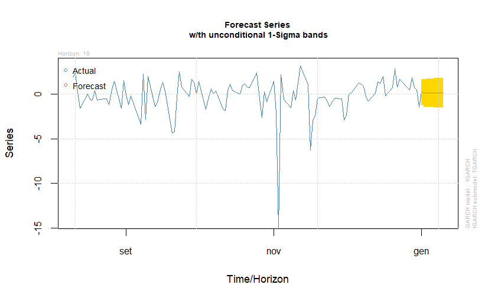

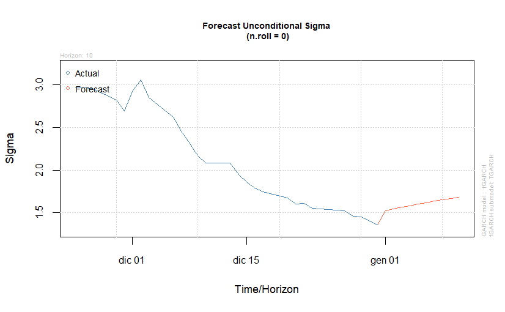

Let’s analyze the **`forc1@forecast`** section:

- **`fit1`** contains all the necessary information, including data
  (hence **`data=NULL`**).

- **`fitorspec`** can be either a model or one that has already been
  estimated with **`ugarchfit`**. In this case, the “simple GARCH” model
  is being used.

- **`H=10`** specifies a forecasting horizon of 10 steps, which
  corresponds to a period of 2 weeks (assuming financial markets are
  closed on weekends).

- Other parameters of the function are set to null.

- **`data`** indicates any additional data required for the analysis.

- “Out-of-sample” implies that, for instance, if there are 1500 data
  points, the last 100 data points are used for forecasting. It
  represents the portion of the time series left for post-analysis.

- **`n.roll`** indicates the number of steps ahead to forecast.

The forecasts include:

- Predictions for returns 10 steps ahead, starting from the last
  out-of-sample observation (the series).

- Forecasted values for sigma, which represents the prediction of
  volatility.

- If you had a pure GARCH model, returns would be equal to 0 because the
  pure GARCH assumes a mean of 0.

- With a fixed time series length (T) and a mobile horizon (H),
  forecasts are made using information up to the last observation in the
  dataset (tail(data, 1)).

- For **`mu`**, it equals 0.16031128, and you want to see if the
  forecasts are close to this value.

- The forecasts mainly pertain to sigma, which should converge in the
  long term to the unconditional sigma of the time series.

- It’s not surprising if the forecasts for mu are mostly constant, as mu
  is typically assumed to be constant in GARCH models.

``` r
spec1x <- getspec(fit1) #estraggo la specificazione di fit1
#descrivo: ho var targ? NO, che modello ho sulla media: arima(1,0,0)=AR(1) e distribuzione std
setfixed(spec1x) <- as.list(coef(fit1))
#con setfixed si considerano come parametri VERI e non come stimati

forc2 <- ugarchforecast(fitORspec = spec1x, n.ahead = H, 
                        data = yret, out.sample = NROW(yret) - 1600, n.roll = 0)
forc2@forecast$seriesFor
```

    ##      2021-05-12
    ## T+1   0.3628214
    ## T+2   0.1466936
    ## T+3   0.1612270
    ## T+4   0.1602497
    ## T+5   0.1603154
    ## T+6   0.1603110
    ## T+7   0.1603113
    ## T+8   0.1603113
    ## T+9   0.1603113
    ## T+10  0.1603113

``` r
forc2@forecast$sigmaFor
```

    ##      2021-05-12
    ## T+1    2.131378
    ## T+2    2.131953
    ## T+3    2.132487
    ## T+4    2.132984
    ## T+5    2.133445
    ## T+6    2.133874
    ## T+7    2.134273
    ## T+8    2.134643
    ## T+9    2.134987
    ## T+10   2.135307

``` r
par(mfrow=c(1,2))
```

``` r
# ANALISI ROLLING:
####3) ex-post, h = 1:H at t = nrow(yret)
forc3 <- ugarchforecast(fitORspec = spec1x, n.ahead = H,  
                        data = yret, out.sample = NROW(yret) - 1600, n.roll = 10)
forc3@forecast$seriesFor
```

    ##      2021-05-12 2021-05-13 2021-05-14 2021-05-17 2021-05-18 2021-05-19
    ## T+1   0.3628214  0.1161627  0.1761318  0.2471558 0.07273262  0.1281512
    ## T+2   0.1466936  0.1632800  0.1592474  0.1544715 0.16620045  0.1624739
    ## T+3   0.1612270  0.1601117  0.1603828  0.1607040 0.15991527  0.1601659
    ## T+4   0.1602497  0.1603247  0.1603065  0.1602849 0.16033791  0.1603211
    ## T+5   0.1603154  0.1603104  0.1603116  0.1603131 0.16030949  0.1603106
    ## T+6   0.1603110  0.1603113  0.1603113  0.1603112 0.16031140  0.1603113
    ## T+7   0.1603113  0.1603113  0.1603113  0.1603113 0.16031128  0.1603113
    ## T+8   0.1603113  0.1603113  0.1603113  0.1603113 0.16031128  0.1603113
    ## T+9   0.1603113  0.1603113  0.1603113  0.1603113 0.16031128  0.1603113
    ## T+10  0.1603113  0.1603113  0.1603113  0.1603113 0.16031128  0.1603113
    ##       2021-05-20 2021-05-21 2021-05-24 2021-05-25 2021-05-26
    ## T+1  0.008284913  0.2551738 0.09188486  0.1662152  0.1204504
    ## T+2  0.170534186  0.1539323 0.16491257  0.1599143  0.1629917
    ## T+3  0.159623852  0.1607402 0.16000187  0.1603380  0.1601310
    ## T+4  0.160357510  0.1602824 0.16033209  0.1603095  0.1603234
    ## T+5  0.160308176  0.1603132 0.16030988  0.1603114  0.1603105
    ## T+6  0.160311493  0.1603112 0.16031138  0.1603113  0.1603113
    ## T+7  0.160311270  0.1603113 0.16031128  0.1603113  0.1603113
    ## T+8  0.160311285  0.1603113 0.16031128  0.1603113  0.1603113
    ## T+9  0.160311284  0.1603113 0.16031128  0.1603113  0.1603113
    ## T+10 0.160311284  0.1603113 0.16031128  0.1603113  0.1603113

``` r
forc3@forecast$sigmaFor
```

    ##      2021-05-12 2021-05-13 2021-05-14 2021-05-17 2021-05-18 2021-05-19
    ## T+1    2.131378   2.024142   1.926516   1.888287   1.849655   1.783911
    ## T+2    2.131953   2.032491   1.942299   1.907084   1.871562   1.811270
    ## T+3    2.132487   2.040221   1.956854   1.924391   1.891698   1.836336
    ## T+4    2.132984   2.047379   1.970287   1.940339   1.910223   1.859331
    ## T+5    2.133445   2.054010   1.982692   1.955047   1.927283   1.880453
    ## T+6    2.133874   2.060155   1.994152   1.968619   1.943005   1.899875
    ## T+7    2.134273   2.065850   2.004746   1.981150   1.957506   1.917752
    ## T+8    2.134643   2.071130   2.014543   1.992728   1.970889   1.934220
    ## T+9    2.134987   2.076025   2.023607   2.003429   1.983248   1.949402
    ## T+10   2.135307   2.080565   2.031996   2.013325   1.994666   1.963409
    ##      2021-05-20 2021-05-21 2021-05-24 2021-05-25 2021-05-26
    ## T+1    1.869527   1.836848   1.788357   1.721933   1.675698
    ## T+2    1.889826   1.859801   1.815341   1.754633   1.712519
    ## T+3    1.908501   1.880885   1.840068   1.784490   1.746048
    ## T+4    1.925696   1.900273   1.862758   1.811800   1.776646
    ## T+5    1.941543   1.918118   1.883603   1.836822   1.804621
    ## T+6    1.956157   1.934558   1.902773   1.859777   1.830241
    ## T+7    1.969643   1.949714   1.920421   1.880863   1.853736
    ## T+8    1.982097   1.963696   1.936680   1.900253   1.875312
    ## T+9    1.993603   1.976605   1.951671   1.918099   1.895146
    ## T+10   2.004238   1.988528   1.965503   1.934540   1.913398
